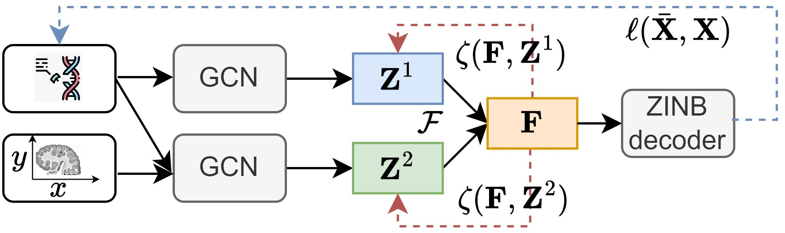

# Balanced Multi-view Clustering

This repository contains simple pytorch implementation of our paper [BMvC](https://arxiv.org/abs/2501.02564) for Spatial Transcriptomics data clustering based on [Spatial-MGCN](https://github.com/cs-wangbo/Spatial-MGCN).

### 1. Overview

      

Illustration of proposed BMvC method on the spatially resolved transcriptomics data clustering task.  

### 2. Usage
+ Prepare the multi-view clustering datasets and put them into ./datasets folder.

+ Prerequisites for Python:
    - Creating a virtual environment in the terminal: `conda create -n BMvC-ST python=3.8`
    - Installing necessary packages: `pip install -r requirements.txt `

+ Download and preprocess Spatial Transcriptomics data following [Spatial-MGCN](https://github.com/cs-wangbo/Spatial-MGCN).

+ For training model, run

- 'python DLPFC_test.py'

### 3. Citation

Please cite our paper if you find the work useful:

    @article{li2025balanced,
    title={Balanced Multi-view Clustering},
    author={Li, Zhenglai and Wang, Jun and Tang, Chang and Zhu, Xinzhong and Zhang, Wei and Liu, Xinwang},
    journal={arXiv preprint arXiv:2501.02564},
    year={2025}
    }

