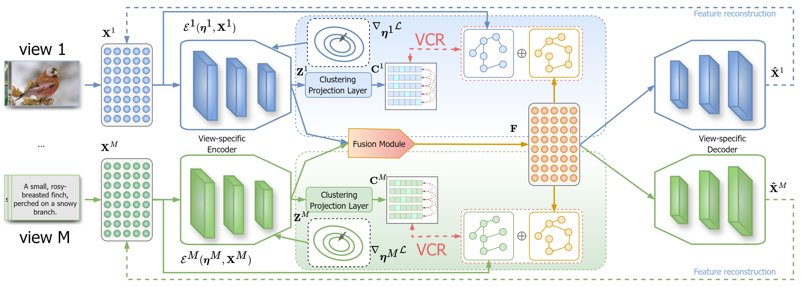

# 
`Balanced Multi-view Clustering (Under Review)`

> **Authors:**
Zhenglai Li, Jun Wang, Chang Tang, Xinzhong Zhu, Wei Zhang, Xinwang Liu

This repository contains simple pytorch implementation of our paper [BMvC](https://arxiv.org/abs/2501.02564).

### 1. Overview

      

Illustration of balanced multi-view clustering (BMvC). The multi-view data are first processed through their encoders to extract view-specific latent features. Next, a fusion module aggregates the representations into a unified joint one, which is then used to reconstruct the multi-view data via view-specific decoders. Finally, the view-specific contrastive regularization (VCR) and feature reconstruction loss are employed to guide the optimization of the model.  

### 2. Usage
+ Prepare the multi-view clustering datasets and put them into ./datasets folder.

+ Prerequisites for Python:
    - Creating a virtual environment in the terminal: `conda create -n BMvC python=3.8`
    - Installing necessary packages: `pip install -r requirements.txt `

+ Train/Test
    - `sh train.sh`

### 3. Citation

Please cite our paper if you find the work useful:

    @article{li2025balanced,
    title={Balanced Multi-view Clustering},
    author={Li, Zhenglai and Wang, Jun and Tang, Chang and Zhu, Xinzhong and Zhang, Wei and Liu, Xinwang},
    journal={arXiv preprint arXiv:2501.02564},
    year={2025}
    }